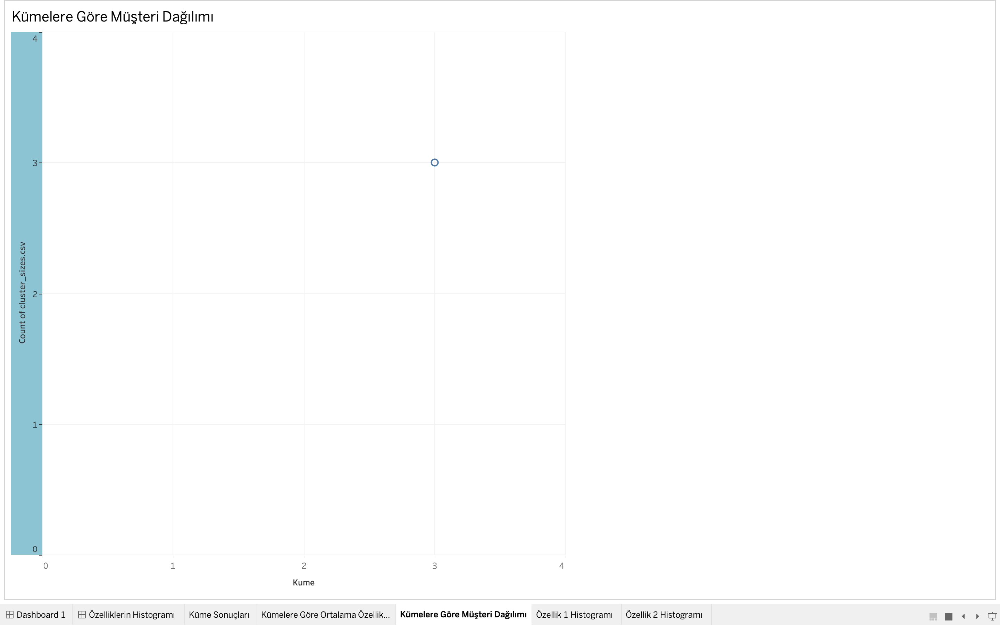
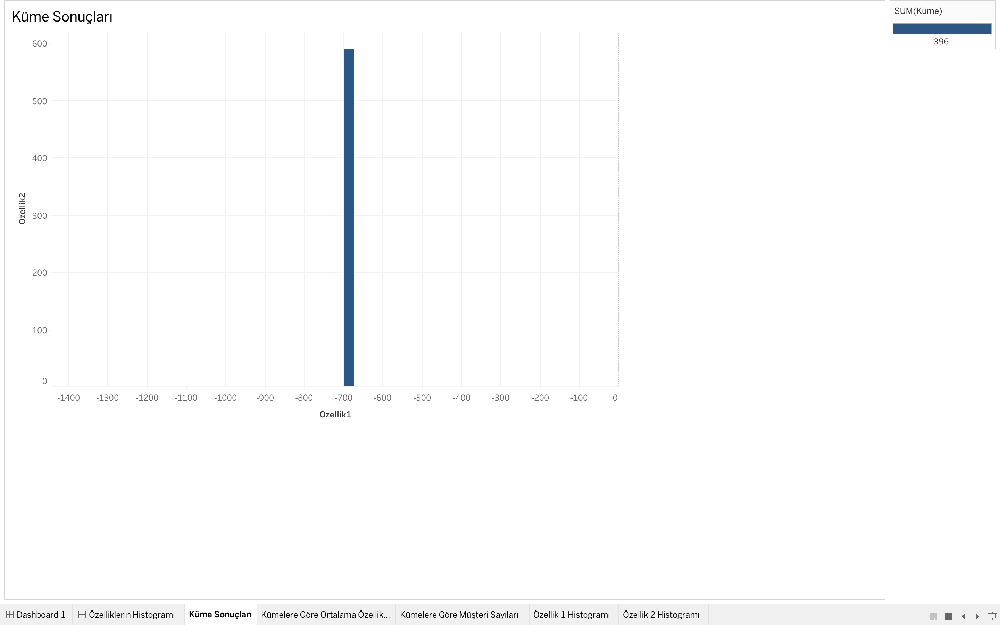
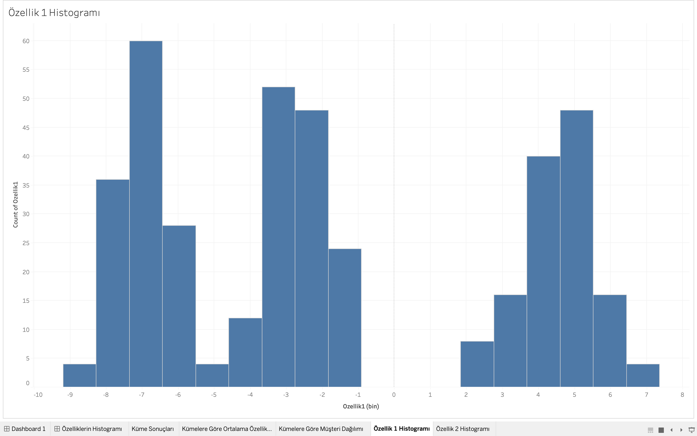

# Müşteri Segmentasyonu Projesi

## 🎯 Proje Amacı

Bu projeyi, müşteri verilerini analiz ederek K-Means kümeleme algoritması ile segmentlere ayırmak için geliştirdim. Segmentasyon sayesinde, her segmentin davranışlarını daha iyi anlayarak müşteri ihtiyaçlarını analiz etmeyi ve pazarlama stratejilerini optimize etmeyi hedefledim. Python, PostgreSQL ve Tableau gibi araçlar kullanarak veri analizi, aykırı değer incelemesi ve görselleştirme çalışmaları gerçekleştirdim.

## 📌 Proje Hedefleri

- Müşteri verilerini segmentlere ayırarak her segmentin özelliklerini anlamak.
- Pazarlama stratejilerinde kullanılabilecek içgörüler elde etmek.
- Kümelerdeki aykırı değerleri analiz ederek verilerin kalitesini artırmak.

## 📈 Proje Sonuçları

1. 3 küme belirlendi:
   - **Küme 0:** Ortalama özelliği düşük müşteriler.
   - **Küme 1:** Orta seviye müşteriler.
   - **Küme 2:** Yüksek özelliklere sahip müşteriler.
2. Küme bazında analizlerle segmentlerin davranışlarını görselleştirdim.
3. Aykırı değerleri başarıyla tespit ederek analizlerde dikkate aldım.

---

## 📋 Projenin İçeriği

1. **Veri Üretimi ve İşleme**
    - Sahte veriyi Python'da `make_blobs` kullanarak ürettim.
    - PostgreSQL veritabanında verileri depoladım.

2. **Kümeleme Analizi**
    - K-Means algoritmasını kullanarak verileri 3 kümeye ayırdım.
    - Küme bazında özet istatistikler hesapladım.

3. **Aykırı Değer Analizi**
    - Python ile `Box Plot` kullanarak aykırı değerleri analiz ettim.

4. **Görselleştirme**
    - Tableau kullanarak küme boyutlarını ve dağılımını görselleştirdim.

---

## 🛠 Kullanılan Teknolojiler

- **Python**: Veri analizi ve kümeleme işlemleri.
- **PostgreSQL**: Veri depolama ve sorgulama.
- **Tableau**: Veri görselleştirme.
- **Kütüphaneler**:
    - pandas
    - numpy
    - scikit-learn
    - seaborn
    - matplotlib
    - psycopg2

---

## 🚀 Projenin Çalıştırılması

### Gereksinimler
- Python 3.8+
- PostgreSQL
- Tableau Desktop veya Tableau Public

### Kurulum
1. Gerekli Python paketlerini yükledim ve kullanıcıların da yüklemesi için:
    ```bash
    pip install -r requirements.txt
    ```

2. PostgreSQL veritabanını başlatmak için `data/setup.sql` veya `src/db_initializer.py` dosyasını çalıştırabilirsiniz.

3. Veri oluşturmak ve PostgreSQL'e yüklemek için:
    ```bash
    python3 src/main.py
    ```

4. Tableau ile görselleştirme için:
    - `cluster_analysis_report.csv` ve `cluster_sizes.csv` dosyalarını Tableau'ya yükledim.
    - Görselleştirmeleri oluşturdum ve siz de kolayca oluşturabilirsiniz.

---

## 📊 Görselleştirmeler ve Önemli Analizler

### 1. Küme Dağılımı
`ozellik1` ve `ozellik2` değerlerinin küme bazlı dağılımını scatter plot ile görselleştirdim. Bu analiz, kümeler arasındaki genel ayrışmayı ve ilişkileri anlamama yardımcı oldu.



---

### 2. Küme Boyutları
Her kümenin müşteri sayısını bar chart ile görselleştirdim. Bu analiz, kümeler arasındaki büyüklük farklılıklarını anlamamı sağladı.



---

### 3. Kümelere Göre Ortalama Özellikler
Her kümenin ortalama ozellik1 ve ozellik2 değerlerini bar chart ile görselleştirdim. Bu analiz, her kümenin özellik değerleri arasındaki farkları ortaya koydu.


---

### 4. Aykırı Değer Analizi
Box Plot kullanarak aykırı değerleri inceledim. Bu analiz, `ozellik1` ve `ozellik2` değerlerindeki uç noktaları görselleştirmeme yardımcı oldu.

#### Özellik 1 için Aykırı Değerler


#### Özellik 2 için Aykırı Değerler


---

🧪 Test Edilebilirlik
Projeyi test etmek için test.py dosyasını oluşturdum. Bu dosya, veritabanını başlatır ve örnek bir veri seti oluşturarak tüm adımları doğrular.

Test Çalıştırma:
```bash
python3 test.py
```

---

## 📂 Proje Yapısı

```plaintext
musteri_segmentasyonu/
│
├── data/
│   └── setup.sql              # Veritabanı tabloları için SQL komutları
│
├── src/                       # Projenin ana kodları
│   ├── main.py                # Ana çalışma dosyası
│   ├── cluster_analysis.py    # Küme analizi ve raporlama
│   ├── csv_to_db.py           # CSV verisini veritabanına aktarma
│   ├── db_connection.py       # PostgreSQL bağlantısı
│   ├── db_initializer.py      # Veritabanı başlatma
│   ├── data_generator.py      # Veri oluşturma ve veritabanına ekleme
│   ├── analysis.py            # Kümeleme analizi
│   ├── visualization.py       # Tableau görselleştirme
│   ├── outlier_analysis.py    # Aykırı değer analizi
│   ├── histogram_analysis.py  # Histogram analizi
│   └── config.py              # Veritabanı yapılandırma ayarları
│
├── assets/                    # Görseller ve ekran görüntüleri
│   ├── bar_chart_results.png
│   ├── bar_chart_averages.png
│   └── scatter_plot_customers.png
│
├── cluster_analysis_report.csv  # Özet istatistik raporu
├── cluster_sizes.csv            # Küme boyutları raporu
├── requirements.txt             # Gerekli Python paketleri
├── README.md                    # Proje açıklaması
└── test.py                      # Projeyi test etmek için test dosyası
```

---

## 📜 Lisans
Projeyi MIT Lisansı ile lisansladım. Bu lisans, projeyi özgürce kullanma, değiştirme ve paylaşma hakkı tanır. Daha fazla bilgi için LICENSE dosyasına göz atabilirsiniz.
