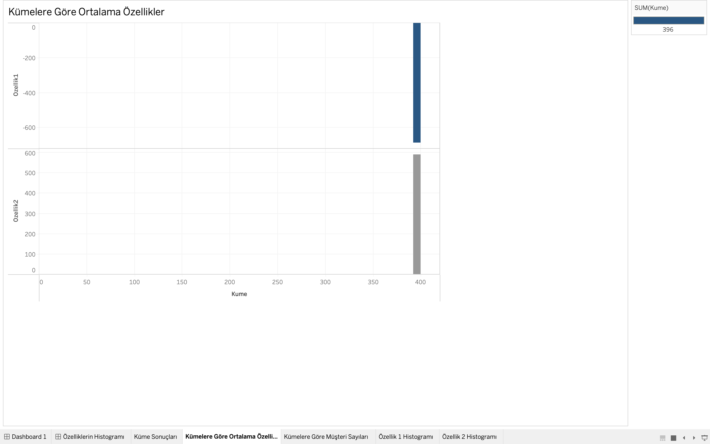
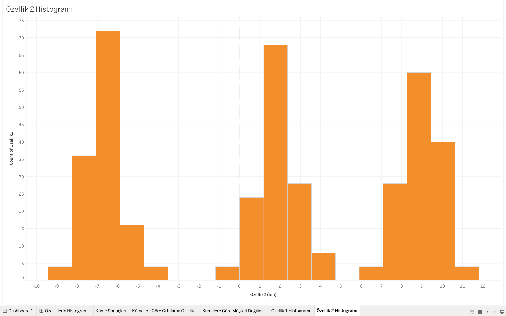

# Müşteri Segmentasyonu Projesi

## 🎯 Proje Amacı

Bu proje, müşteri verilerini analiz ederek K-Means kümeleme algoritması ile segmentlere ayırmayı amaçlamaktadır. Segmentasyon, her segmentin davranışlarını daha iyi anlamayı, müşteri ihtiyaçlarını analiz etmeyi ve pazarlama stratejilerini optimize etmeyi sağlar. Python, PostgreSQL ve Tableau gibi araçlar kullanılarak veri analizi, aykırı değer incelemesi ve görselleştirme gerçekleştirilmiştir.

## 📌 Proje Hedefleri

- Müşteri verilerini segmentlere ayırarak her segmentin özelliklerini anlamak.
- Pazarlama stratejilerinde kullanılabilecek içgörüler elde etmek.
- Kümelerdeki aykırı değerleri analiz ederek verilerin kalitesini artırmak.

## 📈 Proje Sonuçları

1. 3 küme belirlendi:
   - **Küme 0:** Ortalama özelliği düşük müşteriler.
   - **Küme 1:** Orta seviye müşteriler.
   - **Küme 2:** Yüksek özelliklere sahip müşteriler.
2. Küme bazında analizlerle segmentlerin davranışları görselleştirildi.
3. Aykırı değerler başarıyla tespit edildi.

---

## 📋 Projenin İçeriği

1. **Veri Üretimi ve İşleme**
    - Sahte veri oluşturmak için Python'da `make_blobs` kullanıldı.
    - PostgreSQL veritabanında veriler depolandı.

2. **Kümeleme Analizi**
    - K-Means algoritması ile veriler 3 kümeye ayrıldı.
    - Küme bazında özet istatistikler hesaplandı.

3. **Aykırı Değer Analizi**
    - Python ile `Box Plot` kullanılarak aykırı değerler analiz edildi.

4. **Görselleştirme**
    - Tableau kullanılarak küme boyutları ve dağılımı görselleştirildi.

---

## 🛠 Kullanılan Teknolojiler

- **Python**: Veri analizi ve kümeleme işlemleri.
- **PostgreSQL**: Veri depolama ve sorgulama.
- **Tableau**: Veri görselleştirme.
- **Kütüphaneler**:
    - pandas
    - numpy
    - scikit-learn
    - seaborn
    - matplotlib
    - psycopg2

---

## 🚀 Projenin Çalıştırılması

### Gereksinimler
- Python 3.8+
- PostgreSQL
- Tableau Desktop veya Tableau Public

### Kurulum
1. Gerekli Python paketlerini yükleyin:
    ```bash
    pip install -r requirements.txt
    ```

2. PostgreSQL veritabanını başlatın ve `data/setup.sql` veya `src/db_initializer.py` dosyasını çalıştırın.

3. Veri oluşturmak ve PostgreSQL'e yüklemek için:
    ```bash
    python3 src/main.py
    ```

4. Tableau ile görselleştirme için:
    - `cluster_analysis_report.csv` ve `cluster_sizes.csv` dosyalarını Tableau'ya yükleyin.
    - Görselleştirmeleri oluşturun.

---

## 📊 Görselleştirmeler ve Önemli Analizler

### 1. Küme Dağılımı
`ozellik1` ve `ozellik2` değerlerinin küme bazlı dağılımını scatter plot ile görselleştirdim. Bu analiz, kümeler arasındaki genel ayrışmayı ve ilişkileri incelemek için kullanılır.


---

### 2. Küme Boyutları
Her kümenin müşteri sayısını bar chart ile görselleştirdim. Bu analiz, kümeler arasındaki büyüklük farklılıklarını anlamak için önemlidir.


---

### 3. Kümelere Göre Ortalama Özellikler
Her kümenin ortalama `ozellik1` ve `ozellik2` değerlerini bar chart ile görselleştirdim. Bu analiz, her kümenin özellik değerleri arasındaki farkları ortaya koyar.



---

### 4. Aykırı Değer Analizi
Box Plot kullanarak aykırı değerleri inceledim. Bu analiz, `ozellik1` ve `ozellik2` değerlerindeki uç noktaları görselleştirmek için yapılmıştır.

#### Özellik 1 için Aykırı Değerler


#### Özellik 2 için Aykırı Değerler



---

🧪 Test Edilebilirlik
Projenin işlevlerini test etmek için test.py dosyasını çalıştırabilirsiniz. Bu dosya, veritabanını başlatır ve örnek bir veri seti oluşturarak tüm adımları doğrular.

Test Çalıştırma:
```bash
python3 test.py
```

---

## 📂 Proje Yapısı

```plaintext
musteri_segmentasyonu/
│
├── data/
│   └── setup.sql              # Veritabanı tabloları için SQL komutları
│
├── src/                       # Projenin ana kodları
│   ├── main.py                # Ana çalışma dosyası
│   ├── cluster_analysis.py    # Küme analizi ve raporlama
│   ├── csv_to_db.py           # CSV verisini veritabanına aktarma
│   ├── db_connection.py       # PostgreSQL bağlantısı
│   ├── db_initializer.py      # Veritabanı başlatma
│   ├── data_generator.py      # Veri oluşturma ve veritabanına ekleme
│   ├── analysis.py            # Kümeleme analizi
│   ├── visualization.py       # Tableau görselleştirme
│   ├── outlier_analysis.py    # Aykırı değer analizi
│   ├── histogram_analysis.py  # Histogram analizi
│   └── config.py              # Veritabanı yapılandırma ayarları
│
├── assets/                    # Görseller ve ekran görüntüleri
│   ├── bar_chart_results.png
│   ├── bar_chart_averages.png
│   └── scatter_plot_customers.png
│
├── cluster_analysis_report.csv  # Özet istatistik raporu
├── cluster_sizes.csv            # Küme boyutları raporu
├── requirements.txt             # Gerekli Python paketleri
├── README.md                    # Proje açıklaması
└── test.py                      # Projeyi test etmek için test dosyası
```

---

## 📜 Lisans
Bu proje MIT Lisansı ile lisanslanmıştır. Bu lisans, projeyi özgürce kullanma, değiştirme ve paylaşma hakkı tanır. Daha fazla bilgi için LICENSE dosyasına göz atabilirsiniz.
